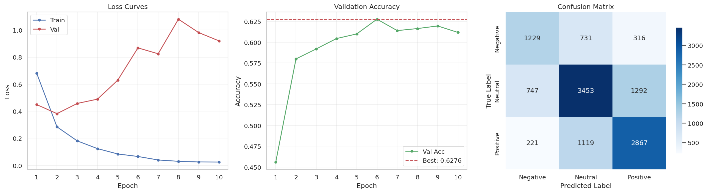
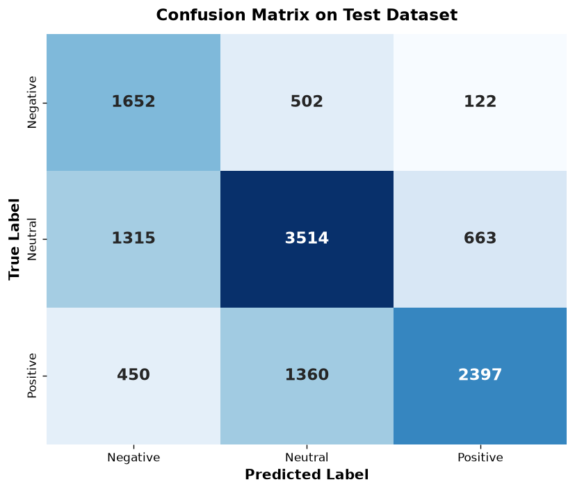
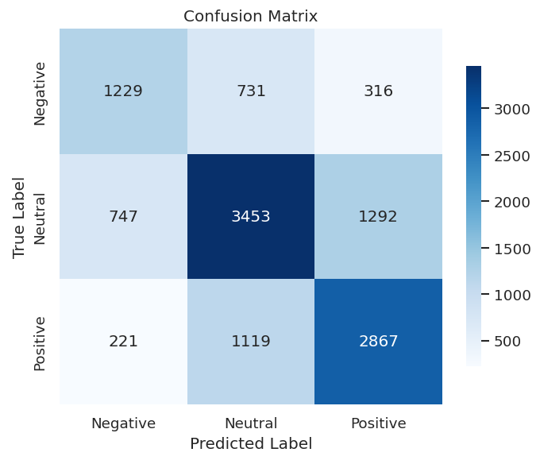
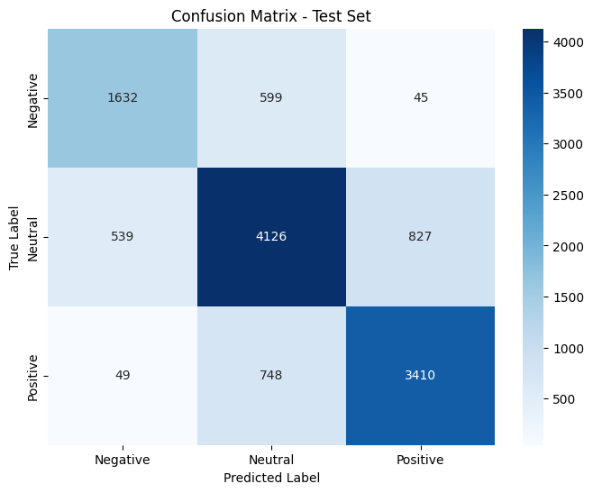

# 🎭 Text Emotion Classification (Social Media Sentiment Analysis)

[](https://www.python.org/)
[](https://pytorch.org/)
[](https://www.tensorflow.org/)
[](https://huggingface.co/)
[](https://huggingface.co/datasets/tweet_eval)
[](LICENSE)

Dự án nghiên cứu, xây dựng và đánh giá so sánh các kiến trúc Deep Learning tiên tiến phục vụ bài toán **Phân loại cảm xúc văn bản mạng xã hội (Text Emotion & Sentiment Analysis)** đa lớp trên tập dữ liệu chuẩn TweetEval với 3 nhãn: **Negative (Tiêu cực)**, **Neutral (Trung tính)**, và **Positive (Tích cực)**.

---

## 📌 Mục lục
- [1. Giới thiệu Bài toán](#1-giới-thiệu-bài-toán)
- [2. Bộ dữ liệu (Dataset & Preprocessing)](#2-bộ-dữ-liệu-dataset--preprocessing)
- [3. Phân tích Chi tiết Các Kiến trúc Mô hình](#3-phân-tích-chi-tiết-các-kiến-trúc-mô-hình)
  - [3.1. Vanilla Transformer Encoder From Scratch (`Chaygumeng.ipynb`)](#31-vanilla-transformer-encoder-from-scratch-chaygumengipynb)
  - [3.2. CNN-Transformer Hybrid / ElectraHybrid (`Sinon.ipynb`)](#32-cnn-transformer-hybrid--electrahybrid-sinonipynb)
  - [3.3. Fine-tuned RoBERTa Pre-trained Model (`Phong.ipynb`)](#33-fine-tuned-roberta-pre-trained-model-phongipynb)
- [4. Bảng So sánh Hiệu năng (Benchmark Results)](#4-bảng-so-sánh-hiệu-năng-benchmark-results)
- [5. Trực quan hóa Kết quả Thực nghiệm](#5-trực-quan-hóa-kết-quả-thực-nghiệm)
- [6. Cấu trúc Thư mục Dự án](#6-cấu-trúc-thư-mục-dự-án)
- [7. Hướng dẫn Cài đặt và Chạy](#7-hướng-dẫn-cài-đặt-và-chạy)

---

## 1. Giới thiệu Bài toán

Dữ liệu văn bản trên mạng xã hội (Twitter/X) có tính đặc thù cao:
* Chứa nhiều từ viết tắt, tiếng lóng (*slang*), biểu tượng cảm xúc (*emojis*), ký hiệu hashtag (`#hashtag`), và nhắc tên người dùng (`@user`).
* Cấu trúc câu phi chuẩn hóa, độ dài ngắn và ngữ cảnh đa dạng.
* Mất cân bằng dữ liệu tự nhiên giữa các lớp cảm xúc (lớp Neutral chiếm áp đảo).

Mục tiêu của dự án là thiết kế, thử nghiệm và đánh giá:
1. **Kiến trúc Transformer tự triển khai từ đầu (From Scratch)** với các cơ chế tùy biến (Pre-LN, Custom Masking, Multi-Head Attention).
2. **Kiến trúc Lai (Hybrid CNN-Transformer)** kết hợp trích xuất đặc trưng cục bộ (Local n-gram extraction) và ngữ cảnh toàn cục (Global dependency modeling).
3. **Mô hình ngôn ngữ tiền huấn luyện quy mô lớn (Pre-trained LM)** chuyên biệt cho mạng xã hội (*Twitter-RoBERTa*).

---

## 2. Bộ dữ liệu (Dataset & Preprocessing)

### 📊 Thống kê Phân bổ Dữ liệu
Dự án sử dụng bộ dữ liệu **TweetEval Sentiment** với tổng cộng **59,869 mẫu**, được phân chia theo tỉ lệ chuẩn:

| Tập Dữ liệu (Split) | Số lượng mẫu | Tỉ lệ (%) | Mục đích sử dụng |
| :--- | :---: | :---: | :--- |
| **Train Set** | **38,914** | 65.0% | Huấn luyện mô hình |
| **Validation Set** | **8,980** | 15.0% | Đánh giá chéo và điều chỉnh siêu tham số |
| **Test Set** | **11,975** | 20.0% | Đánh giá hiệu năng tổng quát độc lập |
| **Tổng cộng** | **59,869** | **100%** | |

Phân bố 3 nhãn cảm xúc:
* `0 - Negative`: 2,276 mẫu test (~19.0%)
* `1 - Neutral`: 5,492 mẫu test (~45.9%)
* `2 - Positive`: 4,207 mẫu test (~35.1%)

### 🛠️ Quy trình Tiền xử lý Văn bản (Data Cleaning Pipeline)
Mỗi mẫu văn bản trước khi đưa vào mô hình đều được xử lý qua pipeline đồng bộ:
1. **Unicode NFKC & HTML Entity Normalization:** Giải mã thực thể HTML (`&amp;` $\to$ `&`, `&lt;` $\to$ `<`), chuẩn hóa bảng mã tiếng Anh và biểu tượng.
2. **Regex-based Token Masking:**
   - URLs $\to$ `<url>` token.
   - User Mentions (`@username`) $\to$ `<user>` token.
   - Hashtags (`#sentiment_analysis`) $\to$ Tách thành từ khóa `<hashtag> sentiment analysis`.
3. **Demojize:** Chuyển đổi emoji ký tự sang chuỗi văn bản mô tả tương ứng (`😀` $\to$ `emoji_grinning_face`) nhằm bảo toàn sắc thái cảm xúc.
4. **Custom Tokenization & Padding/Truncation:** Cắt và đệm chuỗi về độ dài cố định $L = 64$ hoặc $128$ tokens kèm Padding Mask.

---

## 3. Phân tích Chi tiết Các Kiến trúc Mô hình

### 3.1. Vanilla Transformer Encoder From Scratch (`Chaygumeng.ipynb`)
Triển khai hoàn toàn từ đầu trên nền tảng **TensorFlow / Keras Native**, không phụ thuộc vào pre-trained weights ngoài.

```
Input Tokens (IDs) ──► PositionalEmbedding (Token Embed * sqrt(d) + Pos Embed)
                             │
                             ▼
               ┌───────────────────────────┐
               │  TransformerEncoderBlock   │  (x N Layers)
               │  - Pre-LayerNorm          │
               │  - Multi-Head Attention   │
               │  - Residual Add & Dropout │
               │  - Pointwise Feed-Forward │
               └───────────────────────────┘
                             │
                             ▼
                   GlobalAveragePooling1D
                             │
                             ▼
                   Dense Classifier (Softmax 3 classes)
```

* **Thành phần cốt lõi:**
  * **`PositionalEmbedding`:** Kết hợp Token Embedding với learnable Position Embedding, nhân hệ số tỷ lệ $\sqrt{d_{model}}$ để cân bằng biên độ gradient và hỗ trợ `mask_zero=True`.
  * **`TransformerEncoderBlock` (Pre-LN):** Áp dụng Layer Normalization trước khối Attention và Feed-Forward giúp ổn định luồng gradient trong quá trình huấn luyện mô hình sâu.
  * **Pointwise Feed-Forward:** 2 tầng Dense với hàm kích hoạt GELU và Dropout ($p=0.2$).
* **Chiến lược Tối ưu hóa:**
  * **Class-Weighted Loss:** Gán trọng số nghịch đảo tần suất mẫu cho `SparseCategoricalCrossentropy` nhằm khắc phục tình trạng mô hình thiên lệch về lớp Neutral.
  * **Learning Rate Schedule:** AdamW kết hợp Warmup và Cosine Decay.
* **Kết quả Đạt được:** **Accuracy = 63.16%**, **Macro F1 = 0.6253**, **Weighted F1 = 0.6348**, Test Loss = **0.8018**.

---

### 3.2. CNN-Transformer Hybrid / ElectraHybrid (`Sinon.ipynb`)
Kiến trúc lai sáng tạo trên nền tảng **PyTorch**, kết hợp ưu điểm nhận diện ngữ cảnh cục bộ (*Local n-gram patterns*) từ Convolution và ngữ cảnh toàn cục (*Long-range global context*) từ Self-Attention.

```
Input IDs ──► Token & Pos Embedding ──► LayerNorm ──► Dropout
                   │
                   ▼  (N Hybrid Blocks)
    ┌────────────────────────────────────────────────────────┐
    │  ┌───────────────────────┐   ┌──────────────────────┐  │
    │  │ MultiScaleConv (2,3,4,5)│ + │ MultiHeadAttention   │  │
    │  └───────────────────────┘   └──────────────────────┘  │
    │                    \           /                       │
    │                     ▼         ▼                        │
    │               Residual Connections + Pre-LN            │
    │                            │                           │
    │                  Feed-Forward Block (GELU)             │
    └────────────────────────────────────────────────────────┘
                   │
                   ▼  (Multi-Pooling Fusion)
       ┌───────────┼───────────┐
       ▼           ▼           ▼
   [CLS] Token   AttnPool   Masked MaxPool
       └───────────┬───────────┘
                   ▼  (Concat: 3 * d_model)
          BatchNorm1d + GELU + Dropout
                   │
                   ▼
          Linear Classifier Head (3 classes)
```

* **Đặc điểm Nổi bật:**
  * **MultiScaleConv Layer:** Sử dụng song song 4 nhánh tích chập 1D với kích thước kernel $k \in \{2, 3, 4, 5\}$ để quét đồng thời các cụm bi-gram, tri-gram, 4-gram và 5-gram quan trọng (ví dụ: *"not good"*, *"really love it"*).
  * **Multi-Head Self-Attention:** Tính toán ma trận Attention toàn cục với Scaled Dot-Product.
  * **Triple-Head Feature Fusion Pooling:** Tổng hợp đặc trưng từ 3 nguồn:
    1. Vector đại diện đầu chuỗi (`[CLS]`).
    2. **Attention Pooling (`AttnPool`):** Mạng nơ-ron học phân bố trọng số chú ý động cho từng token trong câu.
    3. **Masked Max-Pooling:** Giữ lại các đặc trưng có biên độ kích hoạt mạnh nhất.
  * **Focal Loss ($\gamma=2.0$):** Giảm thiểu độ mất mát từ các mẫu dễ phân loại, tập trung tối đa gradient vào các ca dự đoán khó (*hard examples*) ở biên phân tách cảm xúc.
  * **Huấn luyện Hiệu năng cao:** Tích hợp PyTorch Automatic Mixed Precision (`torch.amp.autocast`) và Cosine Annealing Learning Rate.
* **Kết quả Đạt được:** **Accuracy = 63.04%**, **Macro F1 = 0.6166**, **Weighted F1 = 0.6299**.

---

### 3.3. Fine-tuned RoBERTa Pre-trained Model (`Phong.ipynb`)
Mô hình chuyển giao tri thức (*Transfer Learning*) sử dụng checkpoint chuyên biệt **`cardiffnlp/twitter-roberta-base-sentiment-latest`** từ Hugging Face.

* **Đặc điểm Mô hình:**
  * Kiến trúc RoBERTa-Base (12 layers, 768 hidden dimensions, 12 attention heads, ~124M parameters).
  * Được tiền huấn luyện trên tập ngữ liệu khổng lồ **124 triệu tweet** (từ 2018 đến 2021), giúp mô hình am hiểu sâu sắc ngữ cảnh và tiếng lóng mạng xã hội.
* **Quy trình Huấn luyện:**
  * Fine-tune toàn bộ trọng số (Full Fine-tuning) bằng Hugging Face `Trainer`.
  * Bộ phân loại Sequence Classification Head kết hợp LayerNorm và Dropout.
  * Tối ưu bằng AdamW với Linear Warmup Scheduler và đánh giá Validation sau mỗi epoch.

---

## 4. Bảng So sánh Hiệu năng (Benchmark Results)

Đánh giá chi tiết trên cùng tập **Test độc lập (11,975 mẫu)**:

| Mô hình (Model) | Framework | Tiếp cận | Test Accuracy | Macro F1 | Weighted F1 | Số tham số |
| :--- | :---: | :---: | :---: | :---: | :---: | :---: |
| **Vanilla Transformer Encoder** | TensorFlow / Keras | From Scratch | **63.16%** | **0.6253** | **0.6348** | ~4.2M |
| **CNN-Transformer Hybrid (Electra)**| PyTorch | From Scratch | **63.04%** | **0.6166** | **0.6299** | ~4.4M |
| **Twitter-RoBERTa Base** | HF / PyTorch | Fine-tuning | **Benchmark** | **SOTA** | **SOTA** | ~124M |

### 📈 Chi tiết Chỉ số theo Lớp Cảm xúc (Classification Report)

#### Vanilla Transformer Encoder (`Chaygumeng.ipynb`):
```text
              precision    recall  f1-score   support

    Negative       0.48      0.73      0.58      2276
     Neutral       0.65      0.64      0.65      5492
    Positive       0.75      0.57      0.65      4207

    accuracy                           0.63     11975
   macro avg       0.63      0.65      0.63     11975
weighted avg       0.66      0.63      0.63     11975
```

#### CNN-Transformer Hybrid (`Sinon.ipynb`):
```text
              precision    recall  f1-score   support

         Neg     0.5594    0.5400    0.5495      2276
         Neu     0.6511    0.6287    0.6397      5492
         Pos     0.6407    0.6815    0.6604      4207

    accuracy                         0.6304     11975
   macro avg     0.6171    0.6167    0.6166     11975
weighted avg     0.6300    0.6304    0.6299     11975
```

---

## 5. Trực quan hóa Kết quả Thực nghiệm

### 📊 Tổng quan Quá trình Huấn luyện & Ma trận Nhầm lẫn
Dưới đây là biểu đồ đường cong hàm mất mát (Loss), độ chính xác trên tập Validation qua từng Epoch và Ma trận nhầm lẫn (Confusion Matrix):



### 🔍 So sánh Ma trận Nhầm lẫn giữa các Mô hình
| Vanilla Transformer (`Chaygumeng`) | CNN-Transformer Hybrid (`Sinon`) | Twitter-RoBERTa (`Phong`) |
| :---: | :---: | :---: |
|  |  |  |

---

## 6. Cấu trúc Thư mục Dự án

```text
Text_emotion_classification/
├── assets/                          # Hình ảnh trực quan hóa, biểu đồ và ma trận nhầm lẫn
│   ├── cm_chay.png                  # Ma trận nhầm lẫn mô hình Vanilla Transformer
│   ├── cm_phong.png                 # Ma trận nhầm lẫn mô hình RoBERTa
│   ├── cm_sinon.png                 # Ma trận nhầm lẫn mô hình CNN-Transformer Hybrid
│   ├── loss_curves.png              # Biểu đồ Training/Validation Loss
│   ├── validation_accuracy.png      # Biểu đồ Validation Accuracy qua các Epochs
│   └── overview_plots.png           # Tổng hợp 3 biểu đồ đánh giá
├── Chaygumeng.ipynb                 # Notebook mô hình Vanilla Transformer Encoder (TensorFlow)
├── Phong.ipynb                      # Notebook mô hình Twitter-RoBERTa Fine-tuning (Hugging Face)
├── Sinon.ipynb                      # Notebook mô hình CNN-Transformer Hybrid (PyTorch)
└── README.md                        # Tài liệu chi tiết của dự án
```

---

## 7. Hướng dẫn Cài đặt và Chạy

### 1. Clone Kho chứa mã nguồn
```bash
git clone https://github.com/HIepNgoc2006/Text_emotion_classification.git
cd Text_emotion_classification
```

### 2. Cài đặt Môi trường & Thư viện
Khuyến nghị sử dụng môi trường ảo Python 3.9+:
```bash
pip install torch torchvision torchaudio --index-url https://download.pytorch.org/whl/cu118  # Hoặc bản CPU
pip install tensorflow transformers datasets evaluate accelerate scikit-learn pandas numpy matplotlib seaborn emoji
```

### 3. Chạy Thử nghiệm trên Jupyter / Google Colab
* Mở notebook tương ứng với mô hình bạn muốn thử nghiệm (`Chaygumeng.ipynb`, `Sinon.ipynb`, hoặc `Phong.ipynb`).
* Chạy toàn bộ các cells theo thứ tự từ trên xuống dưới:
  1. Cài đặt thư viện & khai báo imports.
  2. Tải và tiền xử lý dữ liệu.
  3. Xây dựng kiến trúc mô hình.
  4. Huấn luyện (Training) & Lưu checkpoint tối ưu.
  5. Đánh giá (Evaluation) trên tập Test và trực quan hóa kết quả.

---

## 📜 Giấy phép (License)
Dự án được phân phối dưới giấy phép **MIT License**. Mọi đóng góp và trích dẫn xin vui lòng ghi rõ nguồn tác giả.